# Práctica 3 - GitHub y repositorio remoto
## Parte 1: Preparación del Proyecto
### 1. Crear directorios y archivos:

- He creado el directorio GitBonamusaMarc2425, despues creamos la carpeta src dentro y el README.md

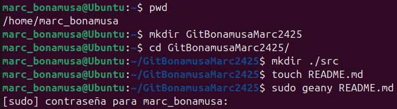

### 2. Inicializa Git:

- Convertimos el respositiorio Git con git init, despues creamos .gitignore y creamos index.html, style.css, main.js en src/

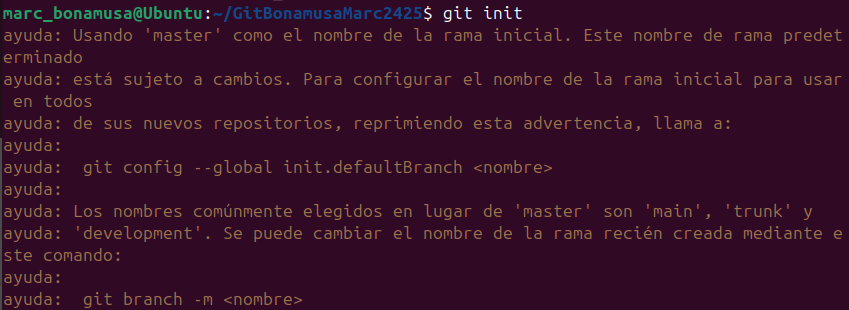

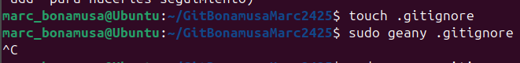

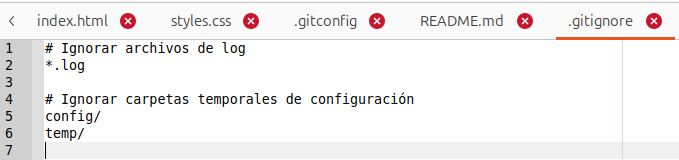

- **Que es el archivo .gitignore?** El archivo .gitignore, es un archivo de texto que le dice a Git qué archivos o carpetas ignorar en un proyecto.

- **Para que sirve el archivo .gitignore?** El archivo gitignore sirve para ignorar archivos o carpetas enteras de nuestro sistema.

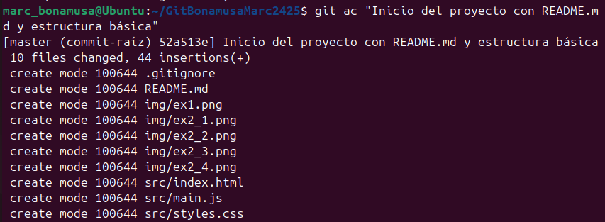

## Parte 2: Colaboración en Equipo
### 1. Configura del repositorio remoto:

- **¿Qué pasa si creo un repositorio con el archivo README.md desde GitHub?** El repositorio remoto no estará vacío porque se crea el archivo README.md automaticamente.

- **¿Qué pasa si crea un repositorio sin el archivo README.md desde GitHub?** El repositorio remoto estará vacío y no tendrá commits iniciales ni archivos.

- **Explica las diferencias entre las 2 preguntas anteriores:**

1. Al crear un repositorio en GitHub con un archivo README.md, GitHub automáticamente añade este archivo al repositorio y genera un commit inicial. Esto significa que el repositorio ya no está vacío y tiene un historial de commits desde el principio.

2. Al crear el repositorio sin un archivo README.md, el repositorio estará completamente vacío. No habrá archivos iniciales ni commits, y por lo tanto, tampoco un historial de cambios.
   
- **Indica que comandos te da GitHub al crear un repositorio:**

1. echo "# Practica3-GitHub" >> README.md
2. git init
3. git add README.md
4. git commit -m "first commit"
5. git branch -M main
6. git remote add origin https://github.com/MarcBonamusa/Practica3-GitHub.git
7. git push -u origin main

### 2. Actualización del Proyecto:

- He creado la rama feature/documentacion, he creado un archivo docs.md y un commit

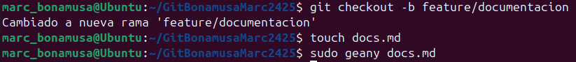

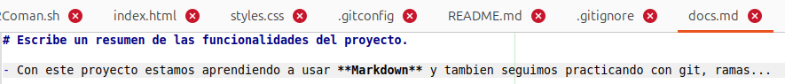

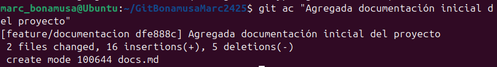

- He usado git diff para comparar las diferencias entre main y feature/documentacion.

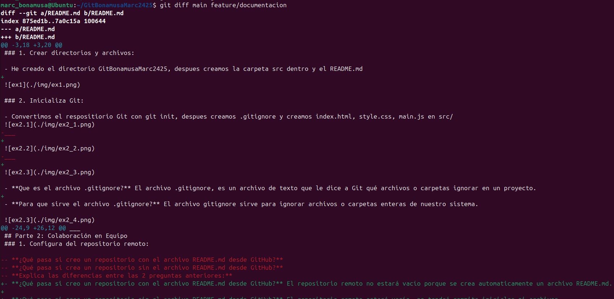

### 3. Sincronización:

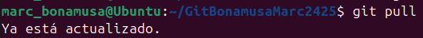

## Parte 3: Gestión de Archivos y Cambios
### 1. Ediciones rápidas:

- He creado el archivo src/app.py, despues lo he añadido y he hecho un commit y verificamos su estado. Con git lg vemos el historial de commits, 

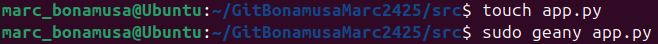

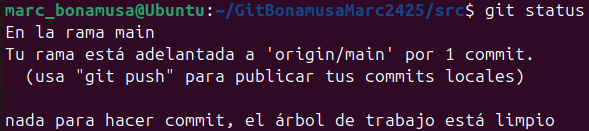

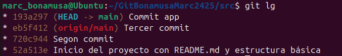

### 2. Borrado y recuperación:

- Borramos el archivo app.py y depues lo volvemos a recuperar

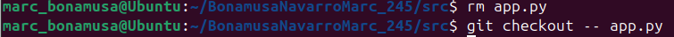

### 3. Combina ramas:

- Fusionamos las dos ramas (master i feature/documetacion) i despues con el alias lg vemos el log de los commits

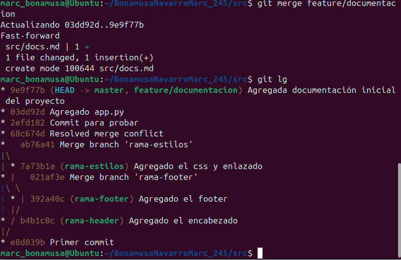

## Parte 4: Entrega del Proyecto

### 1. Últimos pasos:

- Hacemos status para comprobar que esta todo añadido y despues push para subirlo a github

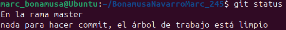

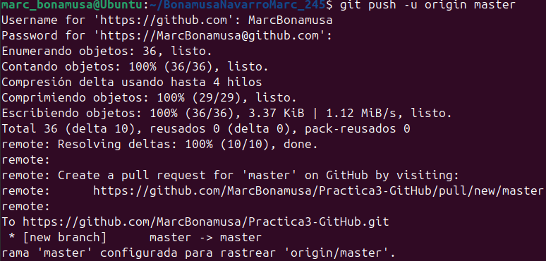

- Ahora borramos la rama feature/documentacion

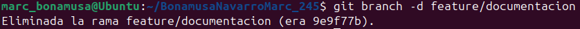

### 2. Explora el proyecto desde el terminal:

- Listamos todos los directorios de nuestra carpeta

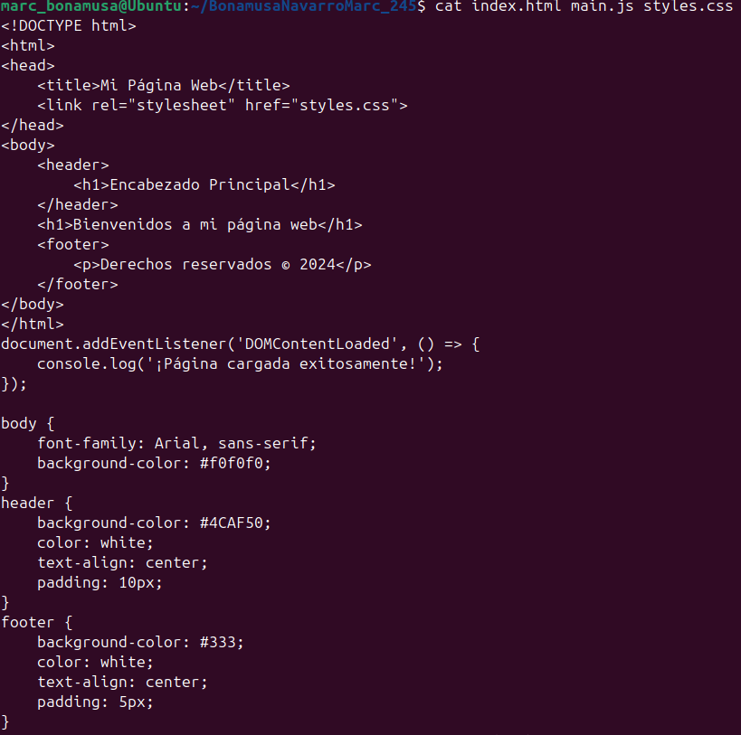

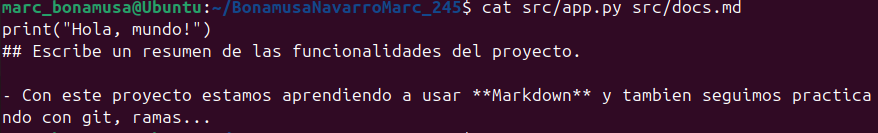
