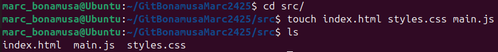

# Práctica 3 - GitHub y repositorio remoto
## Parte 1: Preparación del Proyecto
### 1. Crear directorios y archivos:

### 2. Inicializa Git:

- **Que es el archivo .gitignore?** El archivo .gitignore, es un archivo de texto que le dice a Git qué archivos o carpetas ignorar en un proyecto.
- **Para que sirve el archivo .gitignore?** El archivo gitignore sirve para ignorar archivos o carpetas enteras de nuestro sistema.

